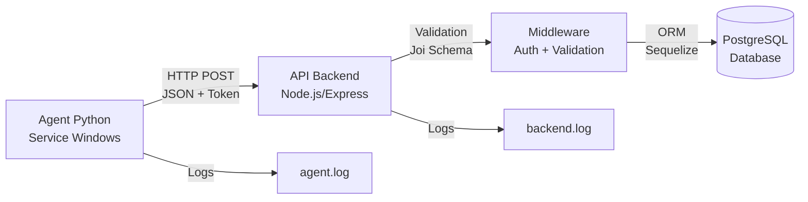

# Document de Design - Sprint 1: Agent Backend

## Overview

Le Sprint 1 implémente un système de collecte automatique de données pour la maintenance prédictive. L'architecture se compose de trois composants principaux :

1. **Agent Python** : Service Windows qui collecte les métriques système et SMART toutes les heures
2. **API Backend Node.js** : Serveur Express qui reçoit, valide et stocke les données
3. **Base PostgreSQL** : Stockage persistant avec schéma relationnel optimisé

Le flux de données est unidirectionnel : Agent → API → Base de données. L'agent fonctionne de manière autonome avec gestion de reconnexion automatique.

## Architecture

### Vue d'ensemble



### Composants Principaux

**Agent Python (agent/)**
- `collector.py` : Collecte métriques CPU, RAM, Disque via psutil
- `smart_reader.py` : Lecture données SMART via pySMART
- `sender.py` : Envoi HTTP avec retry et authentification
- `scheduler.py` : Orchestration des collectes horaires
- `config.json` : Configuration (URL API, token, intervalle)

**API Backend (backend/src/)**
- `routes/data.routes.js` : Définition endpoint POST /api/data
- `controllers/dataController.js` : Logique de traitement des requêtes
- `middleware/auth.js` : Vérification token authentification
- `middleware/validation.js` : Validation JSON avec Joi
- `middleware/error.js` : Gestion centralisée des erreurs
- `models/` : Modèles Sequelize (Machine, Agent, SystemMetrics, SmartData)

**Base de Données (database/)**
- `migrations/` : Scripts de création de tables et index
- `seeders/` : Données de test pour développement

### Flux de Données

1. **Collecte** : L'agent collecte les métriques toutes les heures
2. **Formatage** : Les données sont formatées en JSON selon le schéma
3. **Envoi** : Requête POST avec token dans Authorization header
4. **Authentification** : Le middleware vérifie le token
5. **Validation** : Le middleware valide le schéma JSON
6. **Stockage** : Le contrôleur insère dans PostgreSQL via Sequelize
7. **Réponse** : HTTP 201 avec ID de l'enregistrement

## Components and Interfaces

### Agent Python

#### collector.py

```python
class SystemCollector:
    """Collecte les métriques système via psutil"""
    
    def collect_cpu_metrics() -> dict:
        """
        Retourne: {
            'cpu_usage': float,      # Pourcentage 0-100
            'cpu_temperature': float # Degrés Celsius
        }
        """
        
    def collect_memory_metrics() -> dict:
        """
        Retourne: {
            'memory_usage': float,      # Pourcentage 0-100
            'memory_available': int,    # MB
            'memory_total': int         # MB
        }
        """
        
    def collect_disk_metrics() -> dict:
        """
        Retourne: {
            'disk_usage': float,  # Pourcentage 0-100
            'disk_free': int,     # MB
            'disk_total': int     # MB
        }
        """
        
    def collect_machine_info() -> dict:
        """
        Retourne: {
            'hostname': str,
            'ip_address': str,
            'serial_number': str,
            'os': str
        }
        """
```

#### smart_reader.py

```python
class SmartReader:
    """Lecture des données SMART du disque"""
    
    def read_smart_data() -> dict:
        """
        Retourne: {
            'health_status': str,    # 'GOOD', 'WARNING', 'CRITICAL'
            'read_errors': int,
            'write_errors': int,
            'temperature': float     # Degrés Celsius
        }
        Retourne None si SMART non accessible
        """
```

#### sender.py

```python
class DataSender:
    """Envoi des données vers l'API avec retry"""
    
    def __init__(api_url: str, token: str):
        """Initialise avec URL API et token d'authentification"""
        
    def send_data(payload: dict) -> bool:
        """
        Envoie les données via POST /api/data
        Retry jusqu'à 3 fois avec backoff exponentiel
        Retourne True si succès, False sinon
        """
        
    def _build_headers() -> dict:
        """Construit les headers avec Authorization: Bearer {token}"""
        
    def _retry_with_backoff(func, max_retries=3):
        """Décorateur pour retry avec délai exponentiel"""
```

#### scheduler.py

```python
class CollectionScheduler:
    """Orchestre la collecte horaire"""
    
    def __init__(config_path: str):
        """Charge la configuration depuis config.json"""
        
    def start():
        """Démarre le service de collecte horaire"""
        
    def collect_and_send():
        """
        1. Collecte toutes les métriques
        2. Formate en JSON
        3. Envoie via DataSender
        4. Log le résultat
        """
        
    def stop():
        """Arrête proprement le service"""
```

### API Backend Node.js

#### routes/data.routes.js

```javascript
const express = require('express');
const router = express.Router();
const dataController = require('../controllers/dataController');
const authMiddleware = require('../middleware/auth');
const validationMiddleware = require('../middleware/validation');

/**
 * POST /api/data
 * Reçoit les données d'un agent
 * Middleware: auth → validation → controller
 */
router.post('/data',
    authMiddleware.verifyToken,
    validationMiddleware.validateDataPayload,
    dataController.receiveData
);

module.exports = router;
```

#### controllers/dataController.js

```javascript
class DataController {
    /**
     * Reçoit et stocke les données d'un agent
     * @param req.body - Payload JSON validé
     * @param req.agent - Agent authentifié (ajouté par middleware)
     * @returns 201 avec {id, message} ou erreur
     */
    async receiveData(req, res, next) {
        // 1. Extraire les données du body
        // 2. Trouver ou créer la Machine
        // 3. Insérer SystemMetrics
        // 4. Insérer SmartData
        // 5. Commit transaction
        // 6. Retourner 201 avec ID
    }
}
```

#### middleware/auth.js

```javascript
/**
 * Vérifie le token d'authentification
 * Extrait le token de Authorization: Bearer {token}
 * Vérifie l'existence dans la table Agent
 * Ajoute req.agent si valide
 * Retourne 401 si invalide
 */
async function verifyToken(req, res, next) {
    // 1. Extraire token de Authorization header
    // 2. Chercher dans Agent.findOne({where: {token}})
    // 3. Si trouvé: req.agent = agent; next()
    // 4. Sinon: res.status(401).json({error: 'Unauthorized'})
}
```

#### middleware/validation.js

```javascript
const Joi = require('joi');

/**
 * Schéma de validation Joi pour le payload
 */
const dataPayloadSchema = Joi.object({
    agent_id: Joi.string().uuid().required(),
    machine: Joi.object({
        hostname: Joi.string().required(),
        ip_address: Joi.string().ip().required(),
        serial_number: Joi.string().required(),
        os: Joi.string().required()
    }).required(),
    timestamp: Joi.date().iso().required(),
    system_metrics: Joi.object({
        cpu_usage: Joi.number().min(0).max(100).required(),
        cpu_temperature: Joi.number().min(-50).max(150).required(),
        memory_usage: Joi.number().min(0).max(100).required(),
        memory_available: Joi.number().positive().required(),
        memory_total: Joi.number().positive().required(),
        disk_usage: Joi.number().min(0).max(100).required(),
        disk_free: Joi.number().positive().required(),
        disk_total: Joi.number().positive().required()
    }).required(),
    smart_data: Joi.object({
        health_status: Joi.string().valid('GOOD', 'WARNING', 'CRITICAL').required(),
        read_errors: Joi.number().integer().min(0).required(),
        write_errors: Joi.number().integer().min(0).required(),
        temperature: Joi.number().min(-50).max(150).required()
    }).required()
});

/**
 * Middleware de validation
 * Valide req.body contre le schéma
 * Retourne 400 avec détails si invalide
 */
function validateDataPayload(req, res, next) {
    const {error, value} = dataPayloadSchema.validate(req.body);
    if (error) {
        return res.status(400).json({
            error: 'Validation failed',
            details: error.details
        });
    }
    req.body = value; // Données validées
    next();
}
```

#### middleware/error.js

```javascript
/**
 * Middleware de gestion centralisée des erreurs
 * Capture toutes les erreurs et retourne une réponse appropriée
 */
function errorHandler(err, req, res, next) {
    // Log l'erreur complète
    logger.error({
        message: err.message,
        stack: err.stack,
        url: req.url,
        method: req.method
    });
    
    // Retourner réponse appropriée
    if (err.name === 'SequelizeValidationError') {
        return res.status(400).json({error: 'Database validation failed'});
    }
    
    res.status(500).json({error: 'Internal server error'});
}
```

## Data Models

### Schéma PostgreSQL

```sql
-- Table Machine
CREATE TABLE machines (
    id SERIAL PRIMARY KEY,
    hostname VARCHAR(255) NOT NULL,
    ip_address VARCHAR(45) NOT NULL,
    serial_number VARCHAR(255) UNIQUE NOT NULL,
    os VARCHAR(100) NOT NULL,
    created_at TIMESTAMP DEFAULT CURRENT_TIMESTAMP,
    updated_at TIMESTAMP DEFAULT CURRENT_TIMESTAMP
);

-- Table Agent
CREATE TABLE agents (
    id SERIAL PRIMARY KEY,
    agent_id UUID UNIQUE NOT NULL,
    machine_id INTEGER REFERENCES machines(id) ON DELETE CASCADE,
    token VARCHAR(255) UNIQUE NOT NULL,
    created_at TIMESTAMP DEFAULT CURRENT_TIMESTAMP
);

-- Table SystemMetrics
CREATE TABLE system_metrics (
    id SERIAL PRIMARY KEY,
    machine_id INTEGER NOT NULL REFERENCES machines(id) ON DELETE CASCADE,
    timestamp TIMESTAMP NOT NULL,
    cpu_usage DECIMAL(5,2) NOT NULL,
    cpu_temperature DECIMAL(5,2),
    memory_usage DECIMAL(5,2) NOT NULL,
    memory_available INTEGER NOT NULL,
    memory_total INTEGER NOT NULL,
    disk_usage DECIMAL(5,2) NOT NULL,
    disk_free BIGINT NOT NULL,
    disk_total BIGINT NOT NULL,
    created_at TIMESTAMP DEFAULT CURRENT_TIMESTAMP
);

-- Table SmartData
CREATE TABLE smart_data (
    id SERIAL PRIMARY KEY,
    machine_id INTEGER NOT NULL REFERENCES machines(id) ON DELETE CASCADE,
    timestamp TIMESTAMP NOT NULL,
    health_status VARCHAR(20) NOT NULL CHECK (health_status IN ('GOOD', 'WARNING', 'CRITICAL')),
    read_errors INTEGER NOT NULL DEFAULT 0,
    write_errors INTEGER NOT NULL DEFAULT 0,
    temperature DECIMAL(5,2),
    created_at TIMESTAMP DEFAULT CURRENT_TIMESTAMP
);

-- Index pour performance
CREATE INDEX idx_system_metrics_machine_id ON system_metrics(machine_id);
CREATE INDEX idx_system_metrics_timestamp ON system_metrics(timestamp);
CREATE INDEX idx_smart_data_machine_id ON smart_data(machine_id);
CREATE INDEX idx_smart_data_timestamp ON smart_data(timestamp);
CREATE INDEX idx_agents_token ON agents(token);
```

### Modèles Sequelize

```javascript
// models/Machine.js
const Machine = sequelize.define('Machine', {
    id: {type: DataTypes.INTEGER, primaryKey: true, autoIncrement: true},
    hostname: {type: DataTypes.STRING, allowNull: false},
    ip_address: {type: DataTypes.STRING, allowNull: false},
    serial_number: {type: DataTypes.STRING, unique: true, allowNull: false},
    os: {type: DataTypes.STRING, allowNull: false}
}, {
    tableName: 'machines',
    timestamps: true,
    underscored: true
});

// models/Agent.js
const Agent = sequelize.define('Agent', {
    id: {type: DataTypes.INTEGER, primaryKey: true, autoIncrement: true},
    agent_id: {type: DataTypes.UUID, unique: true, allowNull: false},
    machine_id: {type: DataTypes.INTEGER, references: {model: 'machines', key: 'id'}},
    token: {type: DataTypes.STRING, unique: true, allowNull: false}
}, {
    tableName: 'agents',
    timestamps: true,
    underscored: true,
    createdAt: 'created_at',
    updatedAt: false
});

// models/SystemMetrics.js
const SystemMetrics = sequelize.define('SystemMetrics', {
    id: {type: DataTypes.INTEGER, primaryKey: true, autoIncrement: true},
    machine_id: {type: DataTypes.INTEGER, allowNull: false},
    timestamp: {type: DataTypes.DATE, allowNull: false},
    cpu_usage: {type: DataTypes.DECIMAL(5,2), allowNull: false},
    cpu_temperature: {type: DataTypes.DECIMAL(5,2)},
    memory_usage: {type: DataTypes.DECIMAL(5,2), allowNull: false},
    memory_available: {type: DataTypes.INTEGER, allowNull: false},
    memory_total: {type: DataTypes.INTEGER, allowNull: false},
    disk_usage: {type: DataTypes.DECIMAL(5,2), allowNull: false},
    disk_free: {type: DataTypes.BIGINT, allowNull: false},
    disk_total: {type: DataTypes.BIGINT, allowNull: false}
}, {
    tableName: 'system_metrics',
    timestamps: true,
    underscored: true,
    createdAt: 'created_at',
    updatedAt: false
});

// models/SmartData.js
const SmartData = sequelize.define('SmartData', {
    id: {type: DataTypes.INTEGER, primaryKey: true, autoIncrement: true},
    machine_id: {type: DataTypes.INTEGER, allowNull: false},
    timestamp: {type: DataTypes.DATE, allowNull: false},
    health_status: {
        type: DataTypes.STRING,
        allowNull: false,
        validate: {isIn: [['GOOD', 'WARNING', 'CRITICAL']]}
    },
    read_errors: {type: DataTypes.INTEGER, allowNull: false, defaultValue: 0},
    write_errors: {type: DataTypes.INTEGER, allowNull: false, defaultValue: 0},
    temperature: {type: DataTypes.DECIMAL(5,2)}
}, {
    tableName: 'smart_data',
    timestamps: true,
    underscored: true,
    createdAt: 'created_at',
    updatedAt: false
});

// Relations
Machine.hasMany(SystemMetrics, {foreignKey: 'machine_id'});
Machine.hasMany(SmartData, {foreignKey: 'machine_id'});
Machine.hasOne(Agent, {foreignKey: 'machine_id'});
```

## Correctness Properties

*Une propriété (property) est une caractéristique ou un comportement qui doit être vrai pour toutes les exécutions valides d'un système - essentiellement, une déclaration formelle sur ce que le système doit faire. Les propriétés servent de pont entre les spécifications lisibles par l'humain et les garanties de correction vérifiables par machine.*

